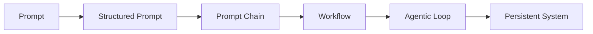
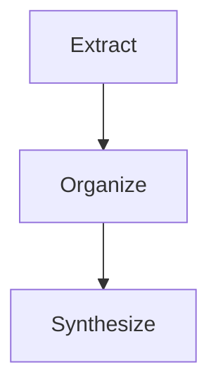
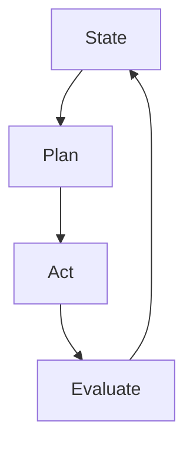
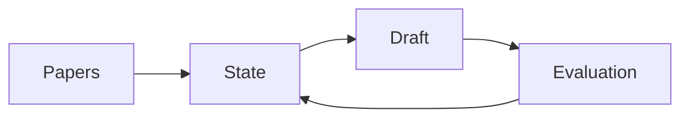
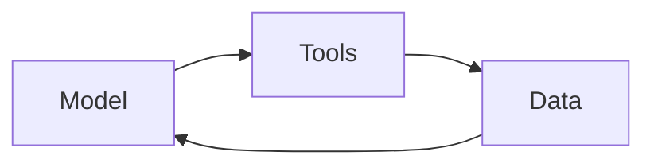
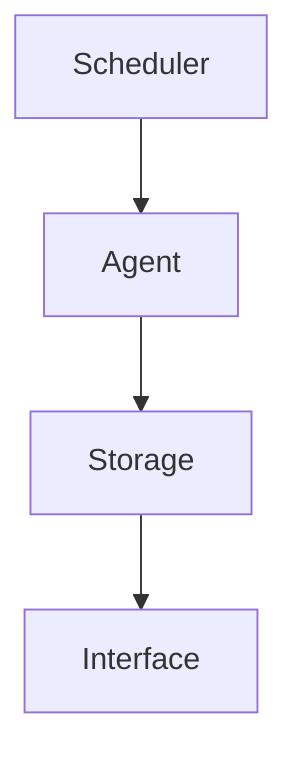
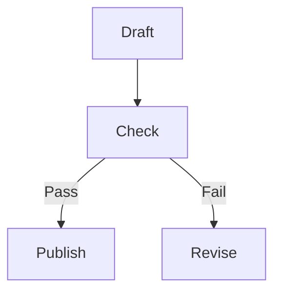
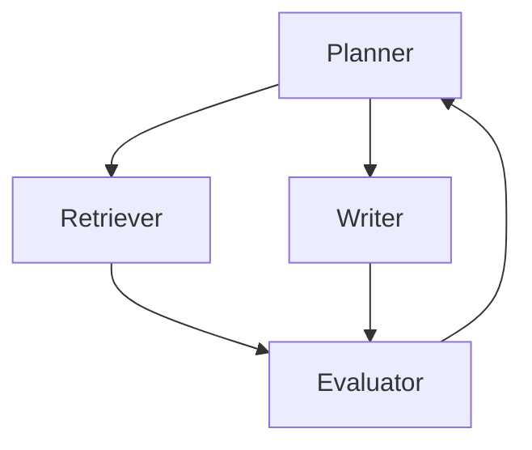
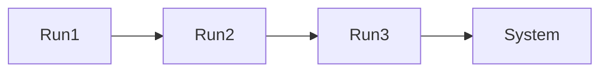

# From Prompts to Systems

{ .page-hero }

Scientific work has always depended on tools that extend human reasoning. From early statistical models to modern numerical simulations, each generation of tools has enabled researchers to ask more complex questions, operate across larger spatial and temporal scales, and integrate increasingly diverse forms of data. Large language models represent a new class of such tools. Unlike prior tools, however, they do not simply compute. They participate in reasoning itself. This makes them both powerful and difficult to use well.

When used only through prompting, LLMs appear as flexible but inconsistent assistants. When embedded within structured workflows, they function as components of computational systems that persist, evolve, and can be inspected over time.

This chapter is about that transition.

The central claim is that the real value of AI in scientific contexts does not come from isolated interactions, but from systems. A single prompt can produce an answer. A system can produce a result, a record of how that result was obtained, and a mechanism for refining that result through iteration.

To ground the discussion, this chapter follows a single running example: a literature synthesis system that continuously ingests new papers, updates a structured synthesis, evaluates its own outputs, logs every decision, and publishes an evolving report. Each section shows how one part of that system is designed.



The progression from prompts to systems. The literature synthesis example follows this same path, becoming more structured and persistent at each stage.

By the end of this chapter, the reader should be able to design and implement a basic agentic system for their own scientific workflow.

## From Prompts to Systems

A prompt is the fundamental unit of interaction with a language model. In the literature synthesis example, an initial prompt might ask the model to summarize a handful of papers. This works for exploration, but it does not scale.

To improve consistency, the prompt is structured. It specifies sections such as methods, results, and gaps. This produces outputs that can be compared and reused.

As more papers are introduced, the task is decomposed. One prompt extracts key points from each paper, another organizes them, and another produces a synthesis. These prompts form a chain.



Prompt chains decompose a task into transformations that can be inspected and improved.

Persistence is introduced when intermediate results are stored. The system now has memory beyond the model context. Finally, evaluation is added, allowing the system to revise outputs. At this point, prompting has become a workflow and then an agentic process.

## Agentic AI as Structured Iteration

In the synthesis system, iteration is introduced when the system evaluates its draft and revises it. This creates a loop.



The agentic loop applied to literature synthesis: plan an outline, act by drafting, evaluate for coverage and citations, update state, and repeat.

At first, a single agent handles all steps. As complexity grows, tools and multiple agents are introduced.

## Memory and State Management

In the synthesis system, memory appears as a state file containing papers, extracted notes, outlines, drafts, and evaluation results. This state is updated at each iteration and stored externally.



State evolves as the system processes new papers and refines its synthesis.

By externalizing memory, the system becomes reproducible and inspectable.

## Specifying Behavior with agents.md

In the synthesis system, behavior is defined in `agents.md`. This file specifies that the planner creates an outline, the executor drafts sections, and the evaluator checks for citations and coverage.

Example:

```markdown
## Task
Maintain an up-to-date literature synthesis.

## Roles
Planner: update outline
Executor: draft sections
Evaluator: verify citations and completeness

## Output
Structured markdown with citations
```

A minimal `agents.md` file defines behavior for the synthesis system and ensures consistent behavior across runs.

## Prompt Logs as Method and Provenance

Each step in the synthesis system is logged. For example, when the evaluator rejects a draft due to missing citations, that decision is recorded.

```json
{"step": 3, "action": "evaluate", "result": "fail", "reason": "missing citations"}
```

Logs make the workflow reproducible and auditable.

## Tool Use and Integration

In the synthesis system, tools retrieve papers, extract metadata, and run analyses. The model proposes actions, but tools execute them.



Tool use connects reasoning to data and computation.

## From Workflows to Systems

The synthesis workflow becomes a system when it runs continuously, ingesting new papers and updating outputs.



The synthesis workflow becomes a system when embedded in infrastructure.

## Evaluation and Validation

In the synthesis system, evaluation checks that each section is complete and properly cited.



Evaluation ensures quality before outputs are accepted.

## Failure Modes and Risk Mitigation

In the synthesis system, failures include missing citations, outdated information, or repeated revisions without improvement. These are mitigated through validation and logging.

| Failure mode | What it looks like | Mitigation |
|---|---|---|
| Hallucination | Unsupported but plausible claims | Require citations, retrieval, and grounding checks |
| Drift | Outputs change as data, prompts, or models change | Version data, prompts, schemas, and model configurations |
| Looping | The system revises repeatedly without improving | Add iteration limits and convergence criteria |
| Silent failure | Errors pass downstream without being noticed | Make validation mandatory and log failures as events |
| Tool misuse | The model calls the wrong tool or uses malformed inputs | Enforce schemas and validate tool arguments before execution |

Common failure modes in agentic systems can be made visible and recoverable through explicit design responses.

## How to Actually Build an Agentic System

The synthesis system is built by defining a loop over state, integrating tools, logging actions, and enforcing evaluation. Each component introduced in earlier sections becomes part of the implementation.

## Multi-Agent Systems in Practice

The synthesis system can be extended with multiple agents: one retrieves papers, another analyzes them, and a third writes the synthesis.



A multi-agent version of the synthesis system separates planning, retrieval, writing, and evaluation.

## Data Contracts and Structured Outputs

The synthesis system uses structured outputs to ensure consistency.

```json
{"section": "methods", "citations": ["paper1", "paper2"]}
```

Structured output ensures compatibility across system components.

## System Growth and Evolution

Over time, the synthesis system improves through better prompts, schemas, and evaluation criteria.



Repeated runs produce system evolution.

## Conclusion

The transition from prompts to systems represents a shift from interaction to infrastructure. By introducing structure, memory, evaluation, and persistence, AI workflows acquire the properties required for scientific practice. The result is not simply automation, but a new form of computational method in which AI is embedded within transparent, reproducible, and evolving systems.
