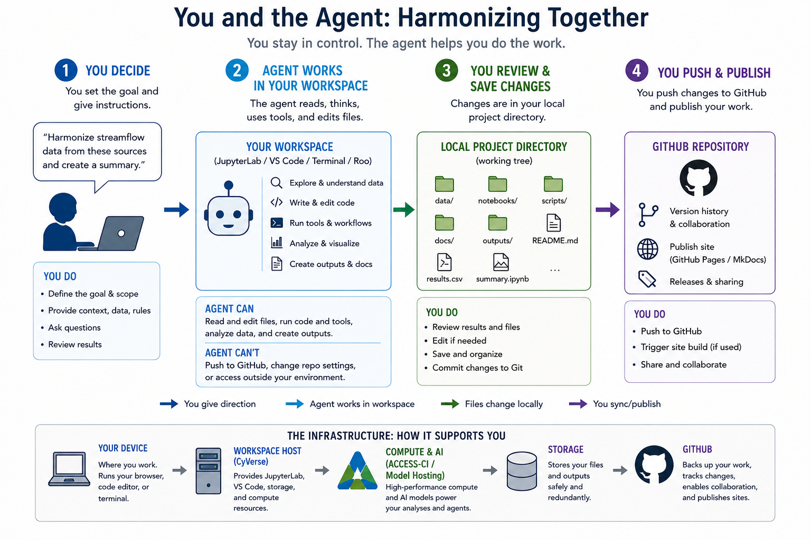
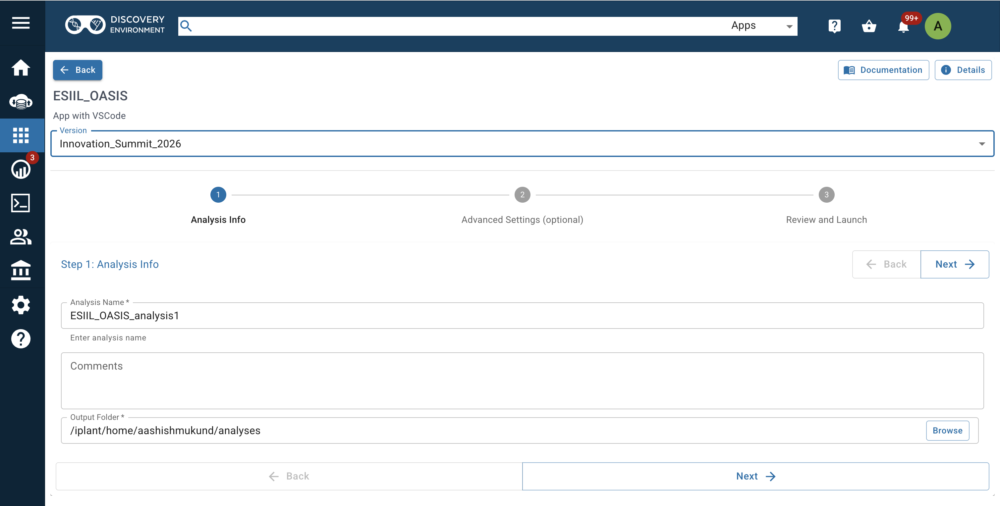
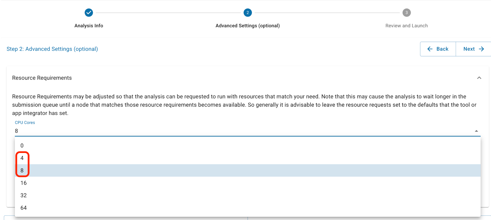
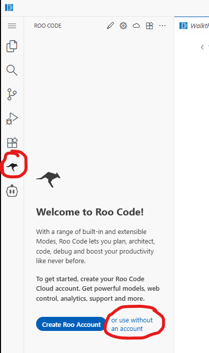
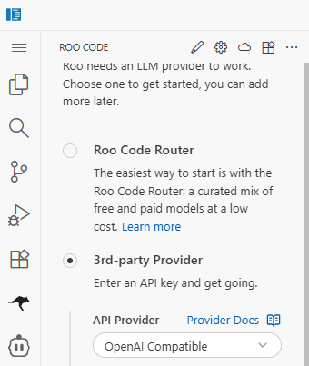
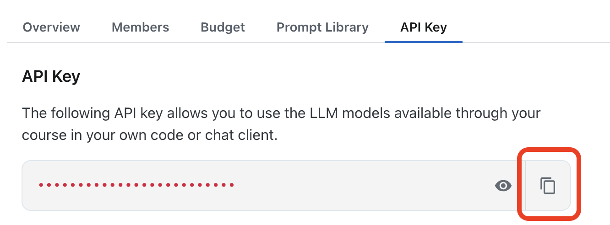
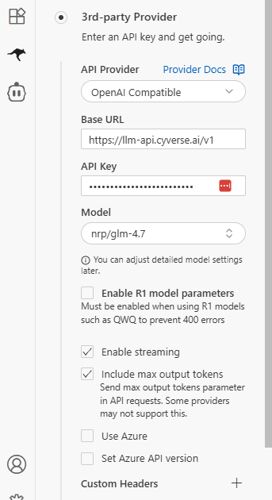
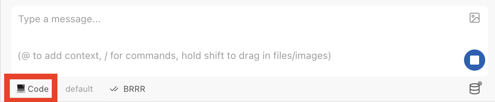
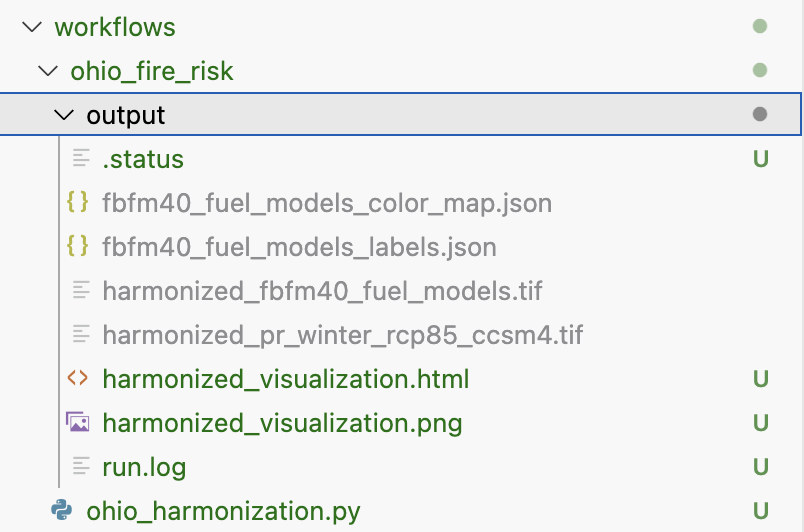

{ .page-hero .cyverse-hero }

# AI Agents using CyVerse

This tutorial is for ESIIL network learners who want to run the lesson in a CyVerse cloud environment rather than on their own laptop. CyVerse gives you a browser-based workspace with compute, storage, and a terminal already available, which is helpful when you do not want to install everything locally or when you want the whole group to work in the same environment.

For more context on the compute environment behind this workflow, see [LLM Hosting and Data Centers](ai-infrastructure/llm-hosting-data-centers.md).

By the end of this page, you will have launched a CyVerse analysis, opened a working session, connected the session to GitHub, cloned the lesson repository, added your LLM credentials safely, run the reference workflow, and checked the output files.

If you already have Python, Git, and an LLM API key working on your own computer, you may prefer the [Run Locally](start-here.md) page.

!!! warning "Do not put secrets in screenshots"
    This page includes workshop screenshots. Before adding or updating screenshots, remove or blur usernames, tokens, API keys, private file paths, email addresses, and anything else that should not be public.

## What you will do

You will move through the workflow in four phases. First, you will launch the CyVerse environment from the direct workshop link. Second, you will open the interactive workspace and terminal. Third, you will connect the workspace to the lesson repository on GitHub. Fourth, you will configure the model access and run the example workflow.

This page is written as a click-by-click guide. The exact button names in CyVerse may change slightly over time, but the workflow should remain the same: open the launch link, start the analysis, open the running analysis, use a terminal, clone the repository, install dependencies, set credentials, and run the lesson.

{ .cyverse-concept-figure }

*Figure: Conceptual algorithm for the CyVerse tutorial. You provide the goal, context, data, and rules; the agent works inside the browser-based workspace to inspect data, edit files, run tools, and create outputs; you review and save the local project changes; then you decide what to push, publish, and share through GitHub.*

## Before you begin

Make sure you have the following before starting:

- A CyVerse account with access to the Discovery Environment or the ESIIL-provided training environment.
- A GitHub account.
- Access to the lesson repository or your fork of it.
- An LLM API key, an ESIIL-provided model endpoint, or instructor-provided credentials for the training.
- Enough time to wait for the cloud environment to launch. The first launch can take several minutes.

For the current workshop:

- You will manually clone the repository for now. The training team may automate this later.
- During testing, the instructor may provide shared API credentials privately. At the summit, participants may use their own credentials or the credentials provided for that event.
- If something does not work, tell the training team what happened. Many issues can be fixed by updating the repository instructions or the `AGENTS.md` guidance.

!!! danger "Protect your API key"
    Never paste an API key into a public Markdown file, notebook cell that will be committed, GitHub issue, screenshot, slide, chat message, or shared document. Use environment variables, an ignored `.env` file, or the secure settings field in the training interface. When asking for help, describe the error without sharing the secret value.

## Step 1: Launch the CyVerse analysis

Use the direct launch link for this workshop. It opens the correct CyVerse app, so you do not need to search for the application manually.

<a href="https://de.cyverse.org/instantlaunch/75a5a13e-7980-11f0-b7e6-008cfa5ae621" target="_blank" rel="noopener noreferrer"></a>

If CyVerse asks you to sign in, log in with your CyVerse account and continue with the launch.

On the launch page:

1. Confirm that the app is the ESIIL OASIS training environment.
2. Ensure the container image **Version** is `4.5`.
3. Name the analysis, decide where you want it saved, and complete the remaining analysis information fields.
4. In **Advanced Settings**, select **4** or **8 CPU Cores**. Start with **4**, but if you run out of memory, select **8** in the future.
5. Click **Launch Analysis**, **Run**, or the final launch button shown by CyVerse.



*Choose container image version `4.5` before launching the analysis.*



*Select 4 or 8 CPU Cores in Advanced Settings.*

??? info "If the direct launch link is not working"
    Use the longer CyVerse navigation path:

    1. Log in to CyVerse at [https://user.cyverse.org](https://user.cyverse.org).
    2. Click **Discovery Environment**.
    3. Launch the Discovery Environment.
    4. Under **Featured Apps**, launch the app **ESIIL_OASIS**.
    5. Ensure the **Version** is `4.5`.
    6. Name the analysis, decide where you want it saved, and complete the analysis information fields.
    7. In **Advanced Settings**, select **4** or **8 CPU Cores**. Start with **4**, but if you run out of memory, select **8** in the future.
    8. Click **Launch Analysis**.

CyVerse will now start the environment. This can take a few minutes. You may see the analysis move through statuses such as submitted, queued, running, or ready.


*Analysis status while the environment starts.*

If you cannot log in or the launch link does not work, stop here and ask the training team to confirm that your account has access to the correct CyVerse resources.

## Step 2: Open the interactive session

When the analysis is ready, open the interactive workspace.

1. Go to your running analyses or notifications.
2. Find the analysis you just launched.
3. Click **Go to Analysis**, **Open**, **Launch**, **Access**, or the link provided by CyVerse.
4. For the `ESIIL_OASIS` app, launch **VS Code** from the analysis interface.
5. The session will open as a browser-based coding environment.

For this lesson, the most important tool is the terminal. In VS Code, open a terminal with **Terminal -> New Terminal**. In JupyterLab, open a terminal with **File -> New -> Terminal**, or by clicking the terminal icon in the launcher.

After VS Code opens, use **File -> Open Folder** and navigate to:

```text
/home/jovyan/work/
```

This is the working folder used in the current training image.


*Opening the interactive VS Code workspace.*


*Opening a terminal inside the CyVerse workspace.*

## Step 3: Confirm Git and Python are available

In the terminal, run:

```bash
git --version
python --version
pwd
```

You should see a Git version, a Python version, and your current working directory. The exact versions do not need to match everyone else's as long as the lesson environment was launched from the correct app.

If `python` does not work, try:

```bash
python3 --version
```

If Git or Python is missing, confirm that you launched the correct CyVerse app.

## Step 4: Connect to GitHub and clone the lesson repository

There are two good ways to connect this environment to GitHub. The widget path is usually easier for new users because it uses JupyterLab's graphical interface and browser-based authorization. The terminal path gives you more direct control and is useful once you are comfortable with Git commands. Both approaches connect the same working environment to the same GitHub repository.

<div class="github-path-panels">
  <div class="github-path-panel github-path-widget">
    <h3>Path 1: JupyterLab GitHub Widget</h3>
    <p><strong>Best for:</strong> learners who want a guided, visual way to connect GitHub without typing Git commands.</p>
    <ol>
      <li>Open JupyterLab in your running instance.</li>
      <li>Find the GitHub or Git widget in the JupyterLab sidebar.</li>
      <li>Choose the option to sign in, authenticate, or authorize GitHub.</li>
      <li>Use the web authorization flow when prompted. This will open GitHub in a browser window.</li>
      <li>Approve the requested access in GitHub.</li>
      <li>Return to JupyterLab and confirm that the widget now shows your GitHub account or repository access.</li>
      <li>Clone or open the lesson repository from the widget interface: <code>https://github.com/CU-ESIIL/LLM_lesson_exemplar.git</code>.</li>
    </ol>
    <p><strong>Why use this path?</strong> The widget keeps the process visual. It is a good choice when you are new to Git, when you are working in a workshop setting, or when you want to avoid command-line authentication issues.</p>
  </div>
  <div class="github-path-panel github-path-terminal">
    <h3>Path 2: Terminal Git</h3>
    <p><strong>Best for:</strong> learners who are comfortable with the command line or who want direct control over Git commands.</p>
    <ol>
      <li>Move to a working directory where you want the lesson files to live. For the current CyVerse training image, the working folder may be:</li>
    </ol>
    <pre><code class="language-bash">cd /home/jovyan/work/</code></pre>
    <p>If that folder does not exist, use your home directory:</p>
    <pre><code class="language-bash">cd ~</code></pre>
    <p>Clone the lesson repository:</p>
    <pre><code class="language-bash">git clone https://github.com/CU-ESIIL/LLM_lesson_exemplar.git
cd LLM_lesson_exemplar</code></pre>
    <p>Confirm that you are inside the repository:</p>
    <pre><code class="language-bash">ls</code></pre>
    <p>You should see files such as <code>README.md</code>, <code>docs/</code>, <code>mkdocs.yml</code>, <code>examples/</code>, or lesson-related folders.</p>
    <p>If you used the VS Code file browser to open <code>/home/jovyan/work/</code>, navigate into the <code>LLM_lesson_exemplar</code> folder after cloning. This is the folder you will use for Roo and terminal commands.</p>
    <p></p>
    <p><em>Cloning the lesson repository from GitHub.</em></p>
    <p>If you plan to edit the lesson and push changes back to GitHub, fork the repository first and clone your fork instead. For simply running the lesson, cloning the public repository is enough.</p>
    <p><strong>Why use this path?</strong> The terminal path is flexible and explicit. It is useful for troubleshooting, for advanced Git workflows, and for users who already manage repositories from the command line.</p>
  </div>
</div>

You only need to complete one of these paths. Once your environment is connected to GitHub, continue to the next step in the workflow.

## Step 5: Create or activate the Python environment

Use the dependency path maintained by the repository. Start with the standard virtual environment approach unless the repository has a different documented setup.

```bash
python -m venv .venv
source .venv/bin/activate
python -m pip install --upgrade pip
pip install -r requirements.txt
```

If `python` does not work but `python3` does, use:

```bash
python3 -m venv .venv
source .venv/bin/activate
python -m pip install --upgrade pip
pip install -r requirements.txt
```

When the environment is active, your terminal prompt may show `(.venv)` at the beginning of the line.

If the repository includes a Conda environment file, such as `environment.yml`, and the instructor tells you to use Conda, use the instructor-provided command instead. Do not mix Conda and virtual environment setup unless you know why you are doing it.

## Step 6: Configure Roo and model credentials

Most LLM workflows need either an API key or a model endpoint. For this workshop, configure Roo inside VS Code to use the CyVerse-hosted OpenAI-compatible endpoint.

Open **Roo** in the left sidebar.

1. Click **use without an account**.
2. Select **3rd-party Provider**.
3. Set **API Provider** to **OpenAI Compatible**.
4. Set **Base URL** to:

```text
https://llm-api.cyverse.ai/v1
```

5. For **OpenAI Compatible API Key**, copy the key from:

```text
https://chat.cyverse.ai/courses/course_d08lbl2f20uc73d4qn9g/apikey
```

If you do not have access to that API key page, let the training team know.



*Opening Roo from the VS Code sidebar and choosing to use it without an account.*



*Selecting the 3rd-party Provider path in Roo.*



*Copying the workshop API key from the CyVerse course page.*

For **Model ID**, pick one of the following models:

- `nrp/qwen3-small`
- `nrp/minimax-m2`
- `js2/gpt-oss-120b`
- `js2/glm-4-7-flash`
  
All the other settings can remain unchanged.

If you want a deeper comparison of model options and tradeoffs, see [Available Models](available-models.md).

!!! warning "Protect API keys"
    Do not paste the API key into a public Markdown file, notebook cell that will be committed, GitHub issue, screenshot, slide, chat message, or shared document. Use the Roo settings field, environment variables, or an ignored `.env` file.

### Configure Roo auto-approve

Configure Roo to automatically run tasks. Otherwise, you will need to monitor the chat frequently for task execution.

1. Click **Settings** in Roo.
2. Navigate to **Auto-Approve**.
3. Check the box next to **Auto-Approve Enabled**.
4. Enable **Read**, **Write**, **MCP**, **Mode**, **Subtasks**, and **Execute**.
5. Leave **Question** unchecked so the LLM can still ask for feedback.
6. Make sure **Code** mode is turned on in the chat interface.



*Configuring Roo Auto-Approve while leaving Questions unchecked.*



*Roo Code mode turned on before running the workflow.*

## Step 7: Run the reference workflow

From the repository root, run the reference example. Use the command maintained by the repository. If the current repository command is still the Colorado fire risk example, use:

```bash
python examples/colorado_fire_risk/colorado_harmonization.py
```

If the repository has moved to a different workflow command, update this page to match the current working example.

As the workflow runs, watch the terminal output. You are looking for three things:

1. The script starts without import errors.
2. The model call succeeds or the lesson uses the configured model endpoint.
3. The workflow writes output files to the expected output folder.


*Use Roo chat with Code mode turned on when asking the agent to run the workflow.*

You can also test the app through Roo's chat. Ask it to harmonize your data. Your request must include:

- projection,
- extent,
- resolution,
- and URLs to download the data from, or a dataset from the data catalog.

For a deeper explanation of how agents operate within structured repositories, see [Agents and Systems](agents-and-systems.md).

If you want more context on why projection, extent, resolution, and dataset alignment matter, see [What Is a Data Harmonizer?](data-harmonizer.md).

The LLM should produce:

- a new folder under `workflows/`,
- an `output/` folder inside that workflow,
- the Python script used to harmonize the data,
- processed versions of each dataset,
- a PNG image showing the datasets side-by-side,
- and an interactive HTML map.



*Example of what the output folder should look like after Roo creates a workflow.*

## LLM tips and guidance

Monitor the LLM closely at the start to ensure it is not waiting for your approval on a task.

Be very specific in your instructions. The example request below shows the level of detail that works well.

It can be slow to generate the outputs, often around 30 minutes. Check the `output/` folder for progress; once you see a `.png` and `.html`, you will know it is done.

Provide good URLs. The next section explains how to get direct download URLs.

If Roo gets stuck on **API Request** for more than 30 seconds:

1. Click the stop button.
2. Click **Continue**.

If the model is doing poorly, try another model.

## Step 8: Check the outputs

Look for generated outputs in the workflow output folder. For the Colorado fire risk example, start with:

```bash
ls examples/colorado_fire_risk/output/
```

The expected outputs may include:

- a record of the data sources used,
- a harmonization plan or explanation,
- a geospatial output or visualization,
- logs or intermediate files,
- and a short written summary of the result.

Open small text outputs directly in the terminal when they exist:

```bash
cat examples/colorado_fire_risk/output/summary.md
```

If the output is a map, image, notebook, or HTML file, open it from the file browser in JupyterLab or VS Code, or download it from CyVerse.


*Checking repository and output files in the workspace file browser.*

## Step 9: Save or download your results

CyVerse sessions are cloud-based. Depending on the training environment, files may persist in CyVerse storage, or they may disappear when the analysis is deleted. Before closing the session, save anything you need.

Common options include:

- Download the output files through the JupyterLab or VS Code file browser.
- Copy important outputs to the CyVerse Data Store if the app is configured for persistent storage.
- Commit non-secret code changes to your GitHub fork.
- Save a short note describing the model, prompt, data sources, and output files you produced.


*Navigating to the working folder before saving or downloading results.*

!!! warning "Only commit files that are safe to share"
    Before committing or downloading results, check that you are not including API keys, private data, private endpoints, or credentials. If you used a `.env` file, it should stay out of Git.

## Optional: ask the agent to harmonize your own data

After the reference workflow runs, you can ask the agent to create a new workflow. Be specific. Include the projection, extent, resolution, and direct download URLs for each dataset.

Example request:

```text
Download these datasets, harmonize them to EPSG:4326 over Colorado, and generate a map:

- FBFM40 fuel models (raster, categorical, resampling_method="nearest"):
  https://www.landfire.gov/data-downloads/CONUS_LF2024/LF2024_FBFM40_CONUS.zip
  Use this CSV for both visualization colors (R, G, B columns) and legend labels:
  https://landfire.gov/sites/default/files/CSV/2024/LF2024_FBFM40.csv

- MACAv2 winter precipitation via OPeNDAP (raster, continuous, variable precipitation, months Dec-Mar):
  http://thredds.northwestknowledge.net:8080/thredds/dodsC/agg_macav2metdata_pr_CCSM4_r6i1p1_rcp85_2006_2099_CONUS_monthly.nc

- MTBS burned area boundaries (vector, do not rasterize):
  https://edcintl.cr.usgs.gov/downloads/sciweb1/shared/MTBS_Fire/data/composite_data/burned_area_extent_shapefile/mtbs_perimeter_data.zip

- Microsoft building footprints (vector, rasterize to presence/absence):
  https://minedbuildings.z5.web.core.windows.net/legacy/usbuildings-v2/Colorado.geojson.zip
```

Good URLs matter. Some download buttons hide the real file URL behind redirects or JavaScript. To get the actual file URL:

For the click-by-click version of this data-source handoff, see [Bring Your Own Data](provide-your-own-data-sources.md).

You have two good options:

1. Use the example datasets from the repository data catalog.
2. Get a direct download URL for public data of your choice from Chrome.

To get the actual file URL from Chrome:

1. Click the download button and let the file start downloading. You can cancel it after it starts.
2. Open `chrome://downloads/`, or press Cmd/Ctrl + J.
3. Right-click the file name and choose **Copy link address**.
4. Paste the URL into a new browser tab as a quick test.

The right URL usually starts downloading the file directly. It often ends in a real file extension such as `.tif`, `.zip`, or `.nc` and does not contain words like `viewer` or `landing`. If it loads a viewer page or a landing page, it is probably not the direct download URL.

There are some exceptions that will not auto-download but are still valid:

- OPeNDAP URLs that contain `dodsC` or `thredds` are data streaming endpoints accessed by code, not browsers. They may show a text page or error in a browser, but they work when used with xarray or NetCDF tools.
- STAC API URLs that end in `/v1` or `/stac` are search catalogs, not file downloads. They may show JSON in a browser, which is correct.

## Common issues

### The CyVerse app does not appear

Confirm that you are logged in with the correct CyVerse account. Some apps are only visible to specific users, teams, or workspaces. If you are using an ESIIL-provided app, ask the training team to confirm that your CyVerse username has access.

### The analysis is stuck in queued or submitted status

Cloud resources may take time to start, especially during a workshop when many people launch at once. Refresh the analyses page and check whether the status changes. If it remains stuck for a long time, ask the training team whether there is a resource limit or whether you should relaunch.

### The interactive session opens but the terminal is missing

In JupyterLab, look for **File -> New -> Terminal** or the terminal icon in the launcher. In VS Code, look for **Terminal -> New Terminal**. If the terminal option is disabled, the app image may not support terminal access. Ask the instructor which app image to use.

### GitHub asks for a username or password

Public repositories should clone without a GitHub login. If you are cloning a private fork or trying to push changes, you may need GitHub authentication. Use GitHub's current recommended authentication method, such as a browser-based flow, SSH key, or personal access token. Do not paste tokens into screenshots or commit them to files.

### The repository did not clone

Check that the terminal has internet access and that the repository URL is correct. Try:

```bash
ping github.com
```

If `ping` is blocked but the browser works, try cloning again. Some systems block `ping` even when Git works.

### A package is missing

Confirm that the virtual environment is active and dependencies were installed in that environment:

```bash
which python
python -m pip list
```

If the environment is not active, run:

```bash
source .venv/bin/activate
```

Then reinstall the dependencies:

```bash
pip install -r requirements.txt
```

### The API key is not found

Confirm that the environment variable is set in the same terminal where you are running the workflow:

```bash
python -c "import os; print('OPENAI_API_KEY is set' if os.getenv('OPENAI_API_KEY') else 'OPENAI_API_KEY is missing')"
```

If it says the key is missing, set the variable again in that same terminal session.

### The model call fails

Check whether the error is about authentication, rate limits, model name, endpoint URL, or network access. These are different problems:

- Authentication error: the key may be missing, expired, pasted incorrectly, or not authorized for that provider.
- Rate limit error: the key is valid, but the account or shared endpoint is temporarily over its limit.
- Model not found: the workflow is asking for a model name that your key or endpoint cannot access.
- Connection error: the CyVerse environment may not be able to reach the model endpoint.

Do not share your full key when asking for help. Share the error type and the command you ran.

### The workflow runs but the output looks wrong

Read the generated plan, logs, and summary before changing code. The goal of this lesson is to make the workflow inspectable. Check which input URLs were used, which model was called, what the harmonization plan says, and whether warnings appeared during the run.

## Next steps

After you can run the reference workflow, continue to the workflow pages and modify one part at a time: the study area, the input datasets, the prompt, the model, or the output format.

Please report what works and what goes wrong. Use the workshop feedback tab, fill out the feedback table if one is provided, or contact the training team on Slack.
