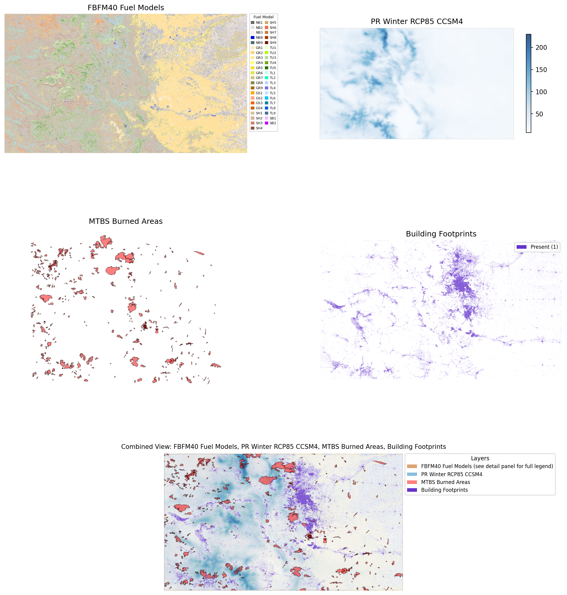

# Colorado Fire Risk

A reference example showing how to harmonize four geospatial datasets over
Colorado using `src/geospatial_harmonizer.py`.

---

## Prompt

> "Download these datasets, harmonize them to EPSG:4326 over Colorado, and
> generate a map. Use the FBFM40 fuel model raster, MACAv2 winter precipitation
> via OPeNDAP, MTBS burned area boundaries as vector, and Microsoft building
> footprints rasterized to presence/absence."

---

## Datasets

| Layer | Type | Source |
|---|---|---|
| FBFM40 Fire Behavior Fuel Models | Raster (categorical) | Landfire 2024, direct ZIP download |
| MACAv2 Winter Precipitation | Raster (continuous) | CCSM4 RCP8.5 Dec–Mar mean 2006–2099, OPeNDAP |
| MTBS Burned Area Boundaries | Vector | USGS perimeter data |
| Microsoft Building Footprints | Vector → rasterized | Microsoft, Colorado state file |

**Target grid:** EPSG:4326 · Colorado extent (-109.05, 36.99, -102.04, 41.01) · ~270 m (0.00243°)

---

## What Was Harmonized

- Categorical raster resampled with `nearest` to avoid interpolating between fuel class codes
- Continuous precipitation streamed via OPeNDAP — only Colorado pixels downloaded
- MTBS fire perimeters kept as vector, aligned to target CRS
- Building footprints rasterized to presence/absence (burn value = 1)

---

## Result



---

## Reproduce It

From the repo root:

```bash
python examples/colorado_fire_risk/colorado_harmonization.py
```

Outputs are saved to `examples/colorado_fire_risk/output/`. Large data files are
gitignored; only the visualization PNG and HTML map are tracked.

---

## Source

Script: [`examples/colorado_fire_risk/colorado_harmonization.py`](https://github.com/CU-ESIIL/LLM_lesson_exemplar/blob/main/examples/colorado_fire_risk/colorado_harmonization.py)
